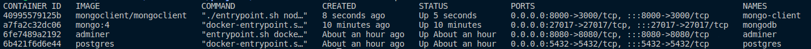

# [Postgres](https://hub.docker.com/_/postgres) container

### Create and run image

> docker run --name postgres -e POSTGRES_USER=deal -e POSTGRES_PASSWORD=p@ssw0RD -e POSTGRES_DB=postgres_database -p 5432:5432 -d postgres

### Show running images

> docker ps

### To access container

> docker exec -it postgres /bin/bash

  

# [Adminer](https://hub.docker.com/_/adminer/) client container

### Create and run client to postgres image

> docker run --name adminer -p 8080:8080 --link postgres:postgres -d adminer

#### To access postgres client [Click Here](http://localhost:8080/?pgsql=postgres)

  

# [MongoDB](https://hub.docker.com/_/mongo) container

### Create and run mongodb

> docker run --name mongodb -p 27017:27017 -e MONGO_INITDB_ROOT_USERNAME=admin -e MONGO_INITDB_ROOT_PASSWORD=admin -d mongo:4

 

# [Mongo Client](https://hub.docker.com/r/mongoclient/mongoclient) container

> docker run --name mongo-client -d -p 3000:3000 --link mongodb:mongodb mongoclient/mongoclient

#### To access mongo client [Click Here](http://localhost:8000/)

 

#### Create user connection with read and write permissions

> docker exec -it mongodb mongo --host localhost -u admin -p admin --authenticationDatabase admin --eval "db.getSiblingDB('mongo_database').createUser({ user: 'deal', pwd: 'p@ssw0rd', roles: [{ role: 'readWrite', db: 'mongo_database' }] })"

   

## To show all containers runnig

> docker ps

 

